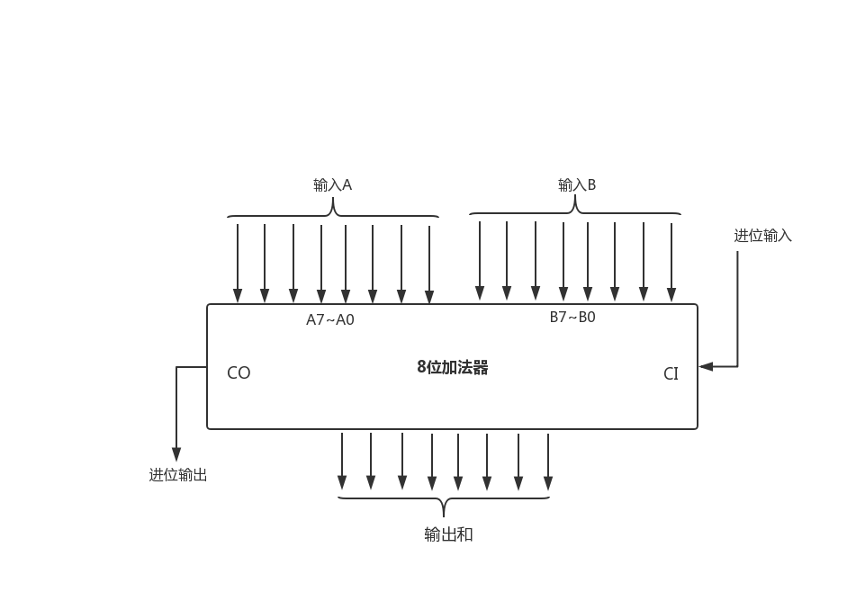
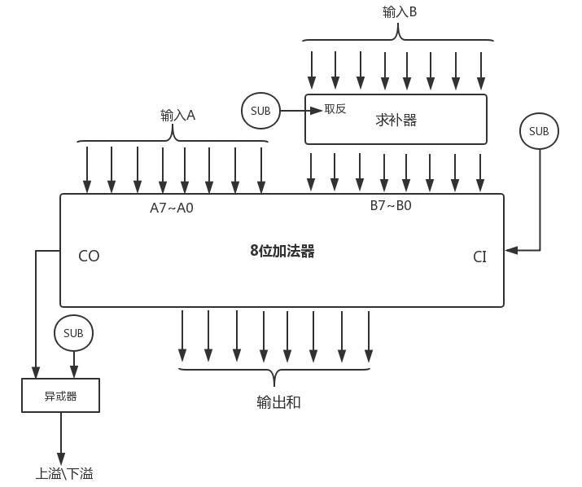

---

---


## 一、逻辑电路

在数字逻辑电路中，电平的高低有两种状态，我们称之为**高电平**、**低电平**。一般规定低电平为0~0.25V,高电平为3.5-5V. 在TTL门电路中，把低电平用数字0表示，把高电平用数字1表示。


由此可以看出，高低电频的表示和二进制数字的表示法一样，那么我们就可以使用组合的逻辑电路来实现二进制之间的逻辑计算。

## 二、门电路

在数字电路中，所谓的“门”就是只能实现基本逻辑关系的电路。二进制最基本的逻辑关系是**与**、**或**、**非**;对应于电路中来说的逻辑门就是**与门**、**或**、**非门**.逻辑门可以用电阻、电容、二极管、三极管等分立元件组成。也可以将门电路的所有器件以及连接导线制作在同一块半导体基片上、构成**集成逻辑门电路**。

> 这里我们不讨论基本的`电阻`，`三极管`等基本元件，详细讨论下三个逻辑门的实现。

#### 与门

在数字逻辑中逻辑与表示从输入到输出的**与**逻辑运算,我们来看一个真值表:

| 输入 |     | 输出    |
| ---- | --- | ------- |
| A    | B   | A AND B |
| 0    | 0   | 0       |
| 0    | 1   | 0       |
| 1    | 0   | 0       |
| 1    | 1   | 1       |

当且仅当两个输入的数都为TRUE时,输出才为TRUE;对应逻辑门电路，仅当输入均为高电平(1)时，输出才为高电平。

对应的逻辑电路图表示如下:


#### 或门

在数字逻辑中逻辑与表示从输入到输出的**或**逻辑运算,我们来看一个真值表:

| 输入 |     | 输出   |
| ---- | --- | ------ |
| A    | B   | A OR B |
| 0    | 0   | 0      |
| 0    | 1   | 1      |
| 1    | 0   | 1      |
| 1    | 1   | 1      |

只要输入的两个数有一个为TRUE时，输出就为TRUE.对应于逻辑电路,只要两个输出中有一个为高电平,则输出为高电平。


#### 非门

非门也称之为反相器，在数字逻辑中表示从输入到输出的取反操作. 真值表如下:

| 输入 A | 输出 NOT |
| ------ | -------- |
| 0      | 1        |
| 1      | 0        |

对应于电路中表示输入高电平则输出低电平。


## 三、组合逻辑电路

上面讲述了最基本的三种组合逻辑电路，我们知道两个数的逻辑运算除了`与`、`或`、`非`还有`异或`、`或非`等等。他们也有对应的组合逻辑门.如下:


这些基本的门电路就是我们计算机硬件端的最基本的“积木”. 就像堆积木一样，我们现在包含十几亿级别的晶体管CPU也是由这样一个一个门电路组合而成的。

在描述组合逻辑电路前，我们先看一下与非门的真值表,之后再了解下异或门是如何构造的。

**与非门**

与非门的输出结果恰好和与门的结果刚好相反，我们看一下它的真值表:

| 输入 |     | 输出 |
| ---- | --- | ---- |
| A    | B   | NAND |
| 0    | 0   | 1    |
| 0    | 1   | 1    |
| 1    | 0   | 1    |
| 1    | 1   | 0    |

**异或门**

我们知道异或是输入相同时为0，输入不同时为1.真值表如下:

| 输入 |     | 输出 | 或门 | 与非门 |
| ---- | --- | ---- | ---- | ------ |
| 0    | 0   | 0    | 0    | 1      |
| 0    | 1   | 1    | 1    | 1      |
| 1    | 0   | 1    | 1    | 1      |
| 1    | 1   | 0    | 1    | 0      |

首先，我们直观上可以看到，或门的输出和我们想要的一样。除了最后一个。与非门的输出也和我们想要的一样除了第一个。所以如果将这两个门的输出在做一次与运算也就得到了我们想要的结果。这便是异或门。


#### 半加器

半加器的功能是将两个一位二进制数相加,它有两个输出:

* 和: 表示这个数的相加之和,用符号`S`表示
* 进位: 只有两个数为1时才会产生进位。用符号`C`表示。

半加器的真值表如下:

| 输入 |     | 输出 |     |
| ---- | --- | ---- | --- |
| A    | B   | C    | S   |
| 0    | 0   | 0    | 0   |
| 0    | 1   | 0    | 1   |
| 1    | 0   | 0    | 1   |
| 1    | 1   | 1    | 0   |

一个最简单的半加器被设计为使用**异或门**来产生S,一个**与门**来产生C.

* 异或门: 相同则为0，不同则为1. 1+1 =》 0 ， 0+0 =》0
* 与门: 当输入同时为1时，输出为1.这就可以表示有进位。

一个半加器的示意图如下:


#### 全加器

从半加器可以看出，如果计算两个1位的二进制数字是没有问题的，但是如果一个二进制数有2位、3位就不行了。不能计算的原因也很简单,它只能接受两个输入的数、却无法接受进位数。所以就有一个全加器的元件来解决这个问题了。

全加器将两个一位二进制数相加，并根据接收到的低位进位信号，输出和、进位输出.全加器的三个输入信号为两个加数A、B以及进位数C. 来看一看真值表:

| 输入 |     |           | 输出      |     |
| ---- | --- | --------- | --------- | --- |
| A    | B   | C (input) | C(output) | S   |
| 0    | 0   | 0         | 0         | 0   |
| 1    | 0   | 0         | 0         | 1   |
| 1    | 0   | 1         | 1         | 0   |
| 1    | 0   | 0         | 0         | 1   |
| 0    | 1   | 1         | 1         | 0   |

全加器的输出和半加器类似，包括高位的进位信号C和本位的和信号S。

全加器的设计也很简单，实际上可以使用两个半加器加上一个或门即可组合成一个全加器。

**第一个半加器和个位的加法一样，得到是否进位X和对应的两个数加完后的结果Y.然后把这个Y和个位的进位信息U在连接到另一个半加器中，就会得到一个是否进位的信号V和对应的加法后的结果W. 这个W便是我们在第二位上留下的结果。 但对于第二位来说也需要判断是否进位，这时只需要将进位信号V和进位信号X进行与运算，便知道是否需要向前进位。**

这样，通过两个半加器和或门，我们就得到一个能够接受进位信号、加数、被加数，这样三个数组成的加法。全加器计算过程如下:


既然有了全加器可以来表示某个位置的加法，那么对于有8位的二进制数我们只需要连接8个就行了。这样也就可以表示8位二进制数相加，也就是一个加法器。不过你可能会发现对于加法后的和的两侧是需要特殊考虑一下。

* 个位来说我们不需要一个全加器，半加器就可以完成工作，当然我们也可以将个位的全加器进位输入始终为0.
* 最左侧的如果有进位信号就无法保存了，因为它已经超出了当前加法器的个数。

所以一个8位的加法器就如下图所示:



CI: 最右侧的进位输入,这里我们将个位的进位输入置为0。

CO: 最左侧的进位输出是因为可能得到9位数值。

在C语言中，部分情况下我们计算两个整数相加会得到一个负数,此时你应该知道了为什么了，因为这个加法的结果溢出了。

加法器有很多种设计方式，可以参考维基百科的设计.[加法器](<https://zh.wikipedia.org/wiki/%E5%8A%A0%E6%B3%95%E5%99%A8>)

## 四、减法

我们知道做一次减法运算其实和一个数加上另一个数的负数是一样的结果，而且计算机中能够表示负数是使用补码进行编码的。补码有一个特性就是可以做算术运算，例如：

```
8 + (-3)
   1000
+  1101
  10101 (5)
```

那么计算机底层的各种逻辑门是如何做减法运算的呢？毕竟对于逻辑电路来说它只拿到的是一串0 1二进制串,并不知道补码、原码、反码这些概念。 这时候我们需要增设一个开关，来判断到底是做加法还是减法。

首先，我们需要解决的是正数如何转化为负数。补码表示中,对一个二进制数取反在加一就可以获得这个数的负数。所以加法器中我们需要引用反向器来对各个位取反。对于一个8位二进制数来说我们需要引用8个反相器。

**事实上我们需要一个即可以做加法、也可以做减法的电路，这里我们引用一个异或门而不是反相器，当取反信号为0时，8个异或门的输入和输出相同，当取反信号为1时，输出结果和输入的数据刚好相反，这个电路也叫作求补器。**

上述的加法器可以改写成如下电路:



上图引用了三个"SUB"标识来作为加法还是减法的开关,当SUB为0时,表示加法,所做的事情和上述的8位加法器一样;当SUB为1时,进行减法运算,也就是x + (-y)的行。

SUB等于1时, B的输入经过求补器得到B的反码，这时在加上CI的进位1便通过这个巧妙的方法得到了B的补码,之后在加上A的输入可得到对应的结果。

这个需要注意一下，就是我们如何区分计算出来的数是正数还是负数呢？ (这中情况只会发生在减法运算中)当减数B小于被减数时，CO端输出为1代表溢出(即,最后的结果需要减去最高位,或者忽略进位),这时SUB也为1,所以两个数经过异或后为0,此时代表正数。相关CO端输出为0时,代表负数。

我们来看一个列子:

#### 减数小于被减数

```
 3 - 2 = ? ==> 3 + (-2) = ?
```

第一步：求-2的补码，既求-2的绝对值2的原码取反（11111101）再加1得11111110。在上图中就是输入B经过取反再加CI等于11111110。

第二步：3的补码（00000011）加上-2的补码（11111110）等于100000001。在上图中就是最后进位1等于CO输出（舍去）即可得到00000001。而CO与SUB均为1，经过异或门为0，此时表示正数，舍弃最高位后即可得到正常值。

#### 减数大于被减数

```
2 - 3 = ? ==> 2 + (-3) = ?
```

第一步：求-3的补码，既求-3的绝对值3的原码取反（11111100）再加1得11111101。在上图中就是输入B经过取反再加CI等于11111101。

第二步：2的补码（00000010）加上-3的补码（11111101）等于11111111。在上图中就是最后进位0等于CO输出。而SUB为1，两个输入1、0经过异或门得1，最左侧输出为1，表示结果为负数。 所以我们也就区分了11111111是补码表示为-1而不是255.

## 五、总结

对于CPU来说,最主要的功能就是计算和存储,计算我们通常用ALU来实现,存储也就是我们常说的寄存器。这个文档我简单介绍了ALU中关于加减法的设计,后续我们将介绍关于存储的设计和实现。
