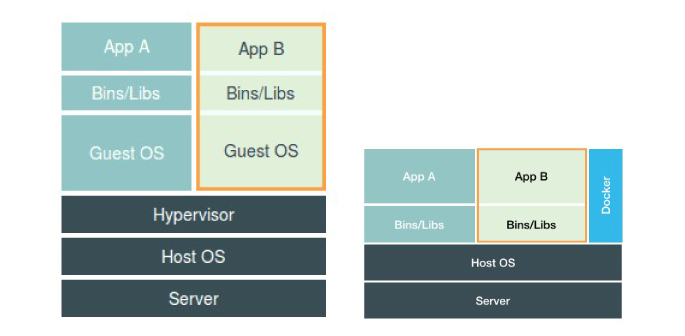
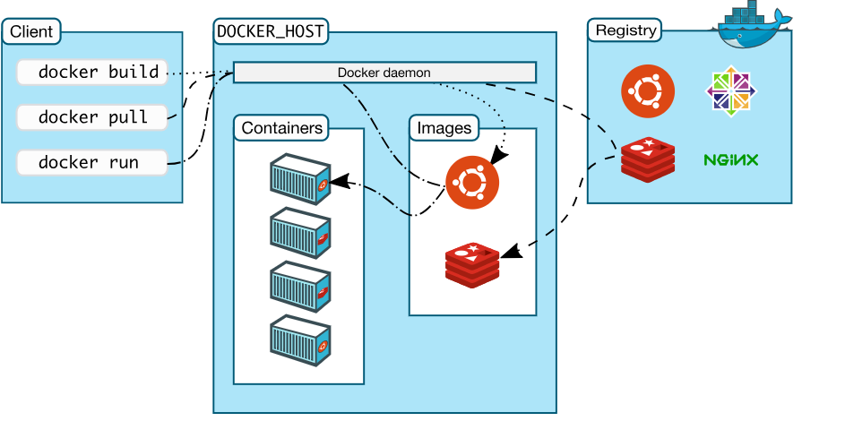

<u>Docker和虚拟机有什么关系和区别？</u>
<u>Docker是如何实现隔离的？</u>


# 一、浅谈Docker历史
2013年我刚进入大学学习技术的时候，在学校的技术社团和老师的谈话中听到最多的莫过于**云计算**,其中听到最多的专业名词是openstack;那时听着他们说叫做IASS项目,不过随着不断的学习OpenStack慢慢淡出了我们视野，随之而来谈论更多的便是**docker**。

在2013PASS的热潮中，dotCloud宣布开源自己的容器项目Docker,在当时容器并不是什么新鲜的东西,并且在之前Cloud Foundry早已实现了"容器"的技术,显然这个决定根本也没有人在乎;但由于Docker独特的**镜像**技术成为Docker弯道超车的不二法宝,并在段段几个月内,Docker项目就迅速崛起,以至于所有的PASS社区在还没有成为他的竞争对手就直接被宣告出局。

2013年底，dotCloud公司决定改名为Docker公司,这为日后容器技术圈埋下了伏笔.

在之后的一段时间里Docker项目一路高歌猛进,一时间，“容器化”取代“pass化”成为基础设施领域最火的关键词,与之而来的便是Docker公司在2014年发布的Swarm项目. 而此时,Docker公司早已开始考虑商业化的途径,毕竟用户始终要部署的还是他们的网站、服务、数据库,这才能够产生真真的商业价值.否则Docker也只是用来启动和暂停的小工具,只是幕后英雄。

CoreOS是一家基础设施领域的创业公司,在Docker项目不久后就将“容器”概念集成到自己的操作系统中,并在短时间内成为了Docker项目中重要力量,但在Docker宣布“Swarm”项目不久后就分道扬镳了,其原因Swarm可以支持更多机器,并且使用Docker项目的原生API来管理,操作方式简洁明了,也奠定了Docker向平台化方向发展,但这却和CoreOS和核心产品和战略发生冲突。

在2014到2015年这段时间里,Docker生态圈的发展非常旺盛,围绕着Docker在各个层次和创新的项目层出不穷,此时,Docker收购了只有两个全职开发和维护的Fig项目,并提供出了**容器编排**的基本概念,这边是大名鼎鼎的**Compose**项目.一时间,整个基础设施大项目都汇聚在Docker公司周围,但也引起了许多人对Docker公司的决策不满,此时也进入了容器发展史的第二阶段。

2014年6月,基础设施领域的翘楚Google公司宣布一个名叫**Kubernetes**的项目诞生,这个项目如同当年Docker一样,再一次改变了容器的市场格局。

在容器领域,Docker早已是一家独大的话语权,但社区成员早已对此抱怨已久。此时,像Google、Redhat等老牌基础设施领域的玩家们,共同发起了一个名为CNCF的基金会,目的是:以kubernetes为基础,建立一个独立基金会方式运营的平台级社区,并以此来抗衡Docker公司的容器生态圈。

2017年开始,Docker公司先是将Docker项目的容器运行时部分Containerd捐给CNCF社区,紧接着将Docker项目改名为Moby,然后交给社区自行维护.

最后Kubernetes凭借这参考Google在容器化基础设施领域多年来实践经验Borg和Omega的特性和社区成员的辛勤努力,并最终在这场竞争中完胜。

* * *
# 二、谈谈进程
#### 2.1 概念
进程：是指计算机中已运行的程序;在**面向进程设计的系统**(Linux 2.4一下)中,进程为程序的基本执行实体;在**面向线程设计系统**中(Linux2.6以上),进程为线程的容器. 其中关于进行的定义也有很多，这里个人比较倾向于这种说法: 进程是具有独立功能的程序在一个数据集合上运行的过程,它是系统进行资源分配和调度的一个独立单位.
从大类划分,可以将进程划分为静态(程序)和运行态(进程):
1. 程序：通常为可执行文件,放置在存储媒介中,是数据和指令的结合。
2. 进程：程序执行时的状态,加载所需要的数据(比如：指令、环境变量)到内存中进行执行计算,操作并给予一个标识符PID(进程ID号)。

不妨来看看一个简单的程序运是如何运行的。
#### 2.2 程序如何被运行
> 假设我们写一个加法的小程序,程序的输入来自于一个文件,计算完成后的结果则输出到另一个文件。

由于操作系统之认识0和1,所以无论什么语言编写的代码最后都会被翻译为机器码,最后才在操作系统中运行起来。

首先,操作系统将可执行文件加载内存中，并交由CPU进行执行,在执行过程中发现需要从文件中读取数据来源,之后并将输入文件加载到内存中保留一份副本进行待命；同时,操作系统读取到计算加法的指令,这时,就会调用CPU完成加法操作；而CPU与内存协作进行加法计算,又会使用寄存器存放数值、内存堆栈等保留执行命令和变量.就这样CPU、内存、I/O、操作系统等共同协作完成了一次加法运算。

可能你还是不太理解到底是如何完成加法的,这里你可以不用深究,只需要明白操作系统就像是人的大脑一样,他指挥这CPU、内存、I/O设备协同工作完成一件事件,就像你的大脑一样指挥这你如何如何工作,什么时候用手、什么时候用嘴说话。

#### 2.3 给进程加个套
对于进程来说,当被运行起来后,需要为它分配很多**资源**和**视图**.视图主要为了描述这个进程,资源主要为了进程内部开销使用.通常一个进程在被启动起来我们要分配：PID、User、系统标识符、netwrok、file system等视图. 在传统的一个系统中运行时,进程所需要的这些视图都是由操作系统进行分配,而且部分视图一旦被其他进程申请后将不能在分配,这也就表明了为什么一个进程监听了操作系统的**80**端口,如果另一个进程在申请监听**80**端口将会出现冲突。

而**容器的核心功能,就是通过约束这些视图的分配，修改进程运行时的表现形式,限制进程的资源开销，从而为其创建一个他无法逃脱的“边界”**。

对于Docker来说,**Namespace技术**主要就是修改进程运行时一些视图分配,而**Cgroup**是限制一个进程资源最大开销。

* * *

# 三、虚拟机VS容器
既然谈到虚拟机,那就不得不放上官方提供的虚拟机和容器的对比图:


*注：这是最新的官方图片,之前是在底层的Hypervisor下还有一层Host OS.*

从上图对比可以看出,在底层上,Docker和Host OS只是替代了虚拟机的Hypervisor.因此,会有很多人认为Docker就是轻量级的虚拟机,但事实真的如此吗？
### 虚拟机
虚拟机（Virtual Machine）指通过软件模拟的具有完整硬件系统功能的、运行在一个完全隔离环境中的完整计算机系统。 --来自【百度百科】

传统的虚拟化技术是对硬件资源的虚拟化,每台虚拟机都要自己的独立的操作系统,这就意味这你可以在windows的机器里安装Linux虚拟机,而且每个虚拟机拥有独立的二进制库、内核. 也就是这里完全是一片新天地,比较常见的是Hypervisor.

### 容器
容器运行在Linux系统本地并且和其他容器共享主机内核。他是一个独立的进程，不占用任何其他可执行文件内存，足够轻量级。
> 单说不够，我们来简单的做个实验，这里假设你有一个安装好的Docker机器。也可以翻到最后查看安装步骤。
```
[root@node2 ~]# docker run -it busybox /bin/sh
```
这表示使用**docker run**启动一个**busybox**虚拟机.而`-it` 表示在启动这个容器之后为这个容器分配一个终端,并进入交互式模式;`/bin/sh` 就表示我们运行容器后要执行的命令,创建一个shell。
此时，我们就进入了在当前容器下的交互shell,可以使用所有的**busybox**命令,所拥有的环境变量都是当前容器下的.
```
/ # printenv
HOSTNAME=3fc8a0273acb
SHLVL=1
HOME=/root
TERM=xterm
PATH=/usr/local/sbin:/usr/local/bin:/usr/sbin:/usr/bin:/sbin:/bin
PWD=/

```
此时，我们执行一下`ps`看看:
```
/ # ps
PID   USER     TIME  COMMAND
    1 root      0:00 /bin/sh
    6 root      0:00 ps
```
可以看到，`ps`命令查看出来的进程和系统的完全不同，此时这个容器就被Docker隔离在一个跟宿主机完全不同的世界中.
其实，这只是操作系统给的障眼法而已,当我们在宿主机上启动一个容器时,其本质也是一个由系统调用产生的进程(clone调用),操作系统还是为其分配一个进程ID号,例如：pid=100. 我们来看看操作系统分配的PID:
```
[root@node2 ~]# docker inspect -f '{{.State.Pid}}' 3fc8a0273
22521
[root@node2 ~]# docker top 3fc8a0273
```
这种机制就是对被隔离应用的进程做了手脚,使得这些进程只能看到重新计算过的进程编号,也就是上述我们在容器里执行`ps`看到的结果.
**这种技术也就是Linux的Namespace技术**,上述我们刚刚看到的pid也就是六大Namespace之一的**PID Namespace**,除此之外还有**User**、**UTS**、**IPC**、**Network**、**Mount**,用于对同一进程上不同的视图进行隔离.

这也是容器最基本的实现原理,可以看出它本质上还是一个进程,只是比较特殊而已。


所以,在上面官方提供的虚拟机对比图中,Docker不应该放在最底层,而是和操作系统里的进程一样,由操作系统管理，而Docker本身则对用户启动的进程完成辅助和管理工作。



> 问题： 既然操作系统已经为这个sh进程分配了一个进程ID号，可是，我们在Docker内部还是看到了sh的另一个进程ID**1**. 难道说操作系统可以随意为进程分配ID号，而且我们知道ID号为1一般是init进程。


* * *
# 四、简述Docker
Docker是一个开发、部输和运行应用程序的开放平台. Docker允许你将应用程序和基础架构分离以便可以快速的通过Docker交付软件,你可以像管理应用程序一样管理基础架构,并且快速传输、测试、部署你的代码，在开发和部署上明显节约时间。
### Docker平台
从上述可以知道，Docker实质上还是一个进程。 Docker提供包含运行应用程序所有环境的包，我们称之为容器，并且之间相互隔离;而且，这就意味着你可以运行多个容器在同一个主机上. 实质上也是宿主机上运行的多个进程. 而管理这里进程的程序，我们称之为Docker Engine.
### Docker架构
Docker采用客户端-服务端架构. Docker客户端和Docker守护进程通信. 这解决了沉重的构建、运行、部署Docker容器.Docker客户端和守护进程可以运行在同样的系统中，也可以通过客户端连接远端的Docker服务端.他们之间基于Unix的套接字或者网络接口通过REST API进行通信。


Docker客户端:
  Docker客户端是Docker用户和Docker交互的主要方式，当你使用docker run命令时，客户端基于API接口将这些命令发送到dockerd。此外一个Docker客户可以和多个Docker服务进程进行通信.

Docker守护进程:
  Docker进程监听docker API的请求和管理Docker对象例如: 镜像、容器、网络和卷. 守护进程可以和其他进程进行通信以管理Docker服务.

Docker registries(Docker仓库):
  Docker registries存储Docker镜像. 像Docker Hub和Docker Cloud是公共镜像库并且所有人都可以访问。Docker的默认查找镜像是通过Docker hub.你也可以使用私人的镜像库.

我们来说一说当执行`docker run`时到底发生了什么？
```
[root@10-19-103-109 ~]# docker run -it ubuntu /bin/bash
```
* Docker在本地查找镜像,如果本地没有ubuntu镜像,Docker将从你配置的仓库下载，像是手动运行`docker pull ubuntu`.
* Docker创建一个新的容器，这个过程像是手动运行`docker container creater`.
* Docker为容器分配可读写的文件系统，作为最后一层. 这允许运行的容器直接的修改文件或者目录在本地文件系统.
* docker创建一个网络接口连接容器的默认网络，如果没有做任何网络配置.这包括为容器分配ip地址。默认容器可以连接到外部网络通过宿主机的网络。
* 启动docker容器并执行/bin/bash,因为容器运行在交互式模式下并占据你的终端.
* 使用exit可以退出当前容器，但容器不会被删除，可以重新启动它。

### 底层技术
上面说过，Docker的实现依赖于Linux的Namespace技术，简单描述下他们的功能:
##### namespace
* The pid namespace: Process isolation (PID: Process ID).  进程间隔离
* The net namespace: Managing network interfaces (NET: Networking).  网络隔离
* The ipc namespace: Managing access to IPC resources (IPC: InterProcess Communication).  进程通信隔离
* The mnt namespace: Managing filesystem mount points (MNT: Mount).  文件系统隔离
* The uts namespace: Isolating kernel and version identifiers. (UTS: Unix Timesharing System).  内核和系统唯一信息隔离（如主机名）

##### Cgroups
Docker引擎依然依赖于linux的另一个技术叫做Cgroups。一个Cgroups限制一个应用程序的资源集合.Cgroups允许Docker引擎共享可用的硬件资源并可以强制限制.例如: 可以限制每个容器的内存使用。
##### Union file systems:
Union file systems或者UnionFS通过创建层来操作文件系统，而且他们将非常的轻量和快速.Docker引擎使用UnionFS为容器提供构建的块. Docker引擎可以使用多个类似UnionFS文件系统，列如： AUFS, btrfs, vfs, 和DeviceMapper。
##### Container format:
Docker引擎联合名称空间、Cgroups、和UnionFS来封装叫做一个容器格式。 默认的容器格式叫做：libcontainer. 之后Docker整合其他技术可能支持其他容器格式例如： BSD jails 或 Solaris Zones.
