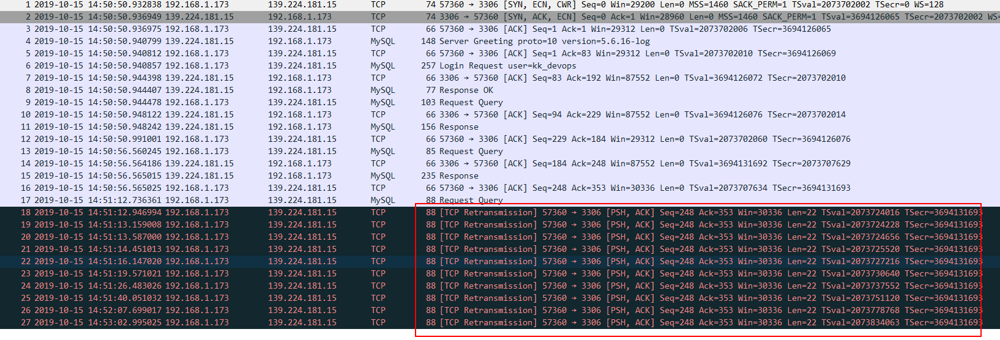
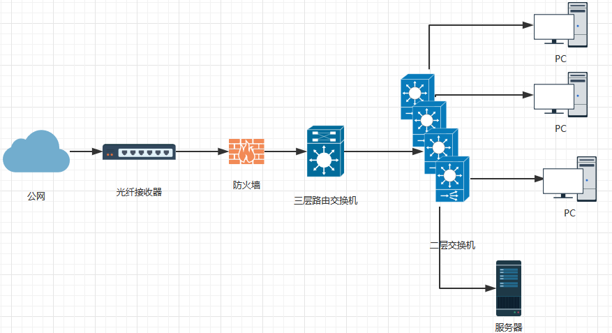

最近公司网络出现一个很诡异的现象,Navicat连接阿里云数据库等待一段时间(大约5s)之后,再次执行相应的SQL语句会变的异常卡顿,经过排查问题出现在我们的防火墙设备上,以下是排查过程.

## 一、现象描述

大约在15号下午左右,开发人员反馈Navicat连接阿里云数据库非常的卡顿,平时秒级的查询今天要查询很久,无法忍受。

接开发人员反馈后立即登陆到本地的一个ubuntu机器进行网络测试,因为从现象上来看可以大致判断这是一个网络问题,于是ping对应的RDS数据后发现网络并没有什么异常。

从上图标红可以看到丢包率为0,每个包的延迟都在3ms左右,可以说是非常的正常,这也说明我们的公司网络整体是正常的。

既然问题是出现在MySQL上,用Navicat现象不明显,此时也就在本地的一台ubuntu机器上使用MySQL客户端连接并抓包来分析一下。发现从数据库认证到执命令是正常的，但隔一段时间后再次执行一条简单的`show databases`语句就会卡住,一下是抓包的结果.

从上面的抓包来看,MySQL客户端户在一次查询语句之后不停的发送TCP Retransmission 重传包,于是问题就清楚了,客户端连接到服务端后发送的包丢失了,这会有一下情况:

1. RDS没有收到客户的查询请求,也就是说包本身没有到服务端
2. RDS本身有问题,没有响应客户端的请求
3. RDS响应了客户端的请求,但是客户端没有接受到对应的响应

## 二、排查问题

从以上情况可以得知,问题出现在服务端、客户端、公网都是有可能的,但是公网不受我们控制,而且即使出现问题也只能找对应的供应商协同排查,所我们先从以下两侧分析.

#### 1、服务端侧排查

由于数据库是阿里云的RDS,我们联系了对应的阿里云工程师查看了RDS的内外网状态,从之前的经验上来看,我更倾向于是阿里云RDS所有在网络的出口IP设备负载跑高导致丢包,而RDS根本就无法接受到数据包,也无法处理。

但阿里云网络工程师和数据库工程师在各个节点上抓包都没有发现问题,此时服务端侧只能排除.为了验证不是服务端的问题，我们同时还做以下验证:

**阿里内网直接访问RDS**

这个只需要在阿里云ECS安装一个MySQL客户后直接连接阿里云的内外网地址即可,从抓包和使用上来看没有任何问题,也没有发现有TCP不断的重传现象.

**公司网络访问其他自建数据库**

公司直接访问其他数据库也发现了同样的问题,客户端过一段时间后不段的发送`[TCP Retransmission]`包,从目前看来网络问题和服务端没有什么关系.

#### 2、客户端侧排查

此时,我们更多的焦点还是定位到公司网络方面,和同事一起梳理了对应的公司网络拓扑图，如下:

从拓扑图可以看出,如果问题出现在公司网络,那么会有以下可能. **光纤接收器**、**防火墙**、**三层路由交换机**、**二层交换机**。所以此时只能使用排除法一个一个来筛选。

公司本地就有一个MySQL服务,使用Navicat连接操作没有任何问题。

所以可以排除**二层交换机**没有问题.

防火墙是华为的设备,跟华为技术人员沟通，我们可以直接让PC连接到防火墙上网,此时我们有以下情况:

* 直连防火墙后访问外网数据库有无问题。 (可以定位防火墙和光纤接收器)。
* 直连防火墙后访问内网本地数据库有无问题。 (可以定位防火墙和三层路由交换机)。

然而,从抓包和测试来看,无论是访问外网还是内网数据库都会丢包,客户端会不断的发送重传包。

**那么问题就确定了，就是这台防火墙在作祟,它将数据包丢弃了**。

## 三、解决问题

我们的防火墙本身是可以抓包的,以下是在防火墙抓的包:

从上面的抓包来看可以得出一下结论:

1. 客户端和服务端在不停的建立连接
2. 客户端在服务端之间出现丢包或者乱序。 参考: [Wireshark网络抓包]( https://www.cnblogs.com/strick/p/6261463.html )
3. 客户端发起TCP三次握手时，seq序列号依然很大,看起来又不像一次TCP连接。

从防火墙的配置来看，MySQL协议的会话超时时间设置的是6s, 这个时间太小了,以至于客户端或服务端还未来的及发送对应的`TCP Keepalive`包,防火墙就将其连接断开，这也就验证了客户端为什么不停的发送重传包和到了超时时间后再建立连接.

修改对应的参数后，我们在客户端抓包如下:

可以看到服务端或客户端会隔一定的时间发送对应的`TCP Keep-Alive`包来保持这个连接，这样在防火墙断开这个连接之前就发送`TCP Keep-Alive`包来确定保持这个连接，防火墙也就不会再断开这个TCP连接.

