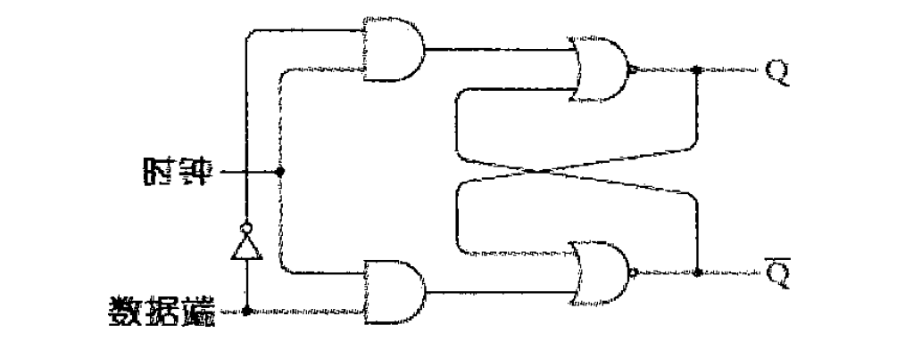
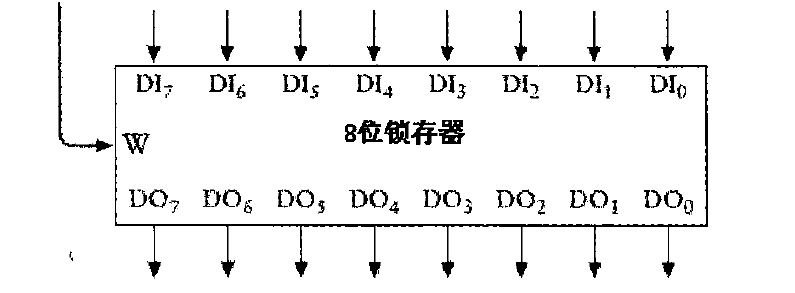

这一篇主要讲解内存和寄存器是如何存储数据。

在**逻辑电路**那篇文章中,讲述了如果使用逻辑门来搭建一个加\减法器,也就是说我们可以模拟CPU做加法运算了,但是这还远远不够,计算的结果我们该如何存储呢？ 我们总不能直接丢弃了吧。

这一篇我就带你来看看如和使用逻辑门来存储一位二进制数据bit,在此基础上在对底层进行抽象看看如何存储多位数据。

## 一、反馈电路

上述所举的例子都是在特定的输入产生特定的输出,那么有没有一种方式输入即是输出,输出也是输入呢？ 就像下面这样。

这个电路装置功能是将输入取反然后再将其输出作为输入,我们把这种电路称为振荡器,而这种电路连接的方式叫做反馈.振荡器本身的输出也是在0和1之间不断的变换,如下图所示:

振荡器从某个状态开始，经过一段时间后又回到初始状态,我们叫做一个循环或者一个周期. 而周期的倒数也就是我们所说的频率,用赫兹来表示。通过我们所说的CPU 2.5GHZ也就是指CPU内部晶体震荡的次数.

**如果我们将反馈的电路用于一对`或非门`看看有会发生什么情况呢？**

#### 或非门

或非门的特点是当输入全为0时输出为1,一个输入为1时输出为0.真值表如下:

| 输入 | 输出 | 结果 |
| ---- | ---- | ---- |
| 0    | 0    | 1    |
| 0    | 1    | 0    |
| 1    | 0    | 0    |
| 1    | 1    | 0    |

我们将两个或非门按照如下方式进行连接:

在初始电路状态下只有左边或非门的输出为1,右边的或非门输出0.  当`1号`输入为1时,左边的输出为0,而`2号`输入还是0,所以右边的或非门输出为1.此时由于电路反馈的原因，我们无论怎么改变`1号`的输入左边或非门的输出都不会发生改变,**永远为0**. 也就是说我们无论为`1号`输入做任何改变都无法改变最终门电路的输出。 这个不觉得很奇怪吗？

现在，我们将`2号`或非门的输入改变为1，此时右边的或非门电路输出永远为0,电路的最终输出也被改变了.  像是我们重置了某种状态让其回到最原始的形态。 而且，我们此时无论对`1号`输入做任何改变都无法改变整个门电路的输出结果。

到目前为止，我们可以总结以上电路的情况:

* `1号`输入为1时，门电路输出为1, 电路确定，不会因`1号`的输入改变而改变
* `2号`输入为1时，门电路输出为0, 电路确定，不会因`2号`的输入改变而改变

以上，对于拥有不同的输入却拥有这相同的输出电路组合我们称之为**触发器**. 触发器可以记住某种状态信息，比如，当我们知道上述的门电路输出为1时，我们也就是知道最后一次输入为1的是`1号`电路。

触发器的种类繁多，下面我们看看常用来存储的触发器。

## 二、触发器

#### R-S 触发器

基本RS触发器又称为SR锁存器，是触发器中最简单的一种，也是各种其他类型触发器的基本组成部分. 由两个**与非门**或者**或非门**的输入端输出端交叉耦合或者首尾相接组成，即可以构成一个基本的RS触发器。

S(Set)表示设置,为高电位;R(reset)表示重置,为低电位。 其输出也包含两个状态,Q和（Q反）。当Set置为1时，Q输出为1，当R置为1时，Q输出为0. 当R和S均为0时，输出Q和Q反保持上一个状态不变。

| S    | R    | Q    | Q反  |
| ---- | ---- | ---- | ---- |
| 1    | 0    | 1    | 0    |
| 0    | 1    | 0    | 1    |
| 0    | 0    | Q    | Q~   |
| 1    | 1    | 禁止 |      |

R-S触发器的连接如下:

#### D触发器

D触发器是在R-S触发器基础上构建出来的,它拥有一个数据端输入位、一个时钟端输入。当时钟端电信号由0转1时，输出的值和输入的值相等。

| D    | Ck   | Q    | Q~   |
| ---- | ---- | ---- | ---- |
| 0    | 1    | 0    | 1    |
| 1    | 1    | 1    | 0    |
| X    | 0    | Q    | Q~   |

由此，我们便使用D触发器锁住了一位bit位二进制数.为了便于理解，我们将`时钟`可以理解为允许写入线,将`数据端`理解为允许写入的数据。并将其封装在一个盒子中,拥有此盒子便可以向盒子读写1bit的数据和读取数据。其抽象的结构便如下图所示:

很容易想到，如果我们把8个这样的设备组合在一起也就成了一个可以保存8位二进制数的存储元件,那64位呢？也就是一个可以存储64个二进制位的存储器,像这样的器件我们也可以叫做寄存器。

下图是一个可以存储8位的触发器示意图：

## 三、寄存器和内存

寄存器的设计相对于内存还是比较简单一点，我们只需要讲对应的数据流连接到对应的接口(引脚)上,当写信号到来时,我们把数据一一灌入到对应的锁存器里就行.但是内存并非如此,我们知道内存通常是我们给定一个地址然后对这个地址上的数据进行操作,这里有一个地址的概念. 

>相对于内存来说,寄存器的读写操作是通过寄存器文件中每个寄存器的ID来进行读写操作。

#### 寄存器

所以我们将上述的8位所存储进行抽象成为一个8位寄存器:

#### 内存

`内存的最大一个特点就是我们给定一个地址,然后可以在该地址上读取或写入一个数.`

## 四、总结

计算机底层对用来说隐藏了很多抽象细节,也是这些我们看不到的细节让我们觉得计算机一直是个谜,这里存储器或者寄存器的设计要比这个麻烦的多,我们不必追究其底层实现的每个细节,其需要了解其底层的核心原理即可。

这里假设我们实现了一个64位的寄存器和多位的存储器(内存)。